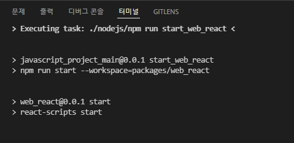
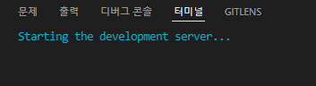
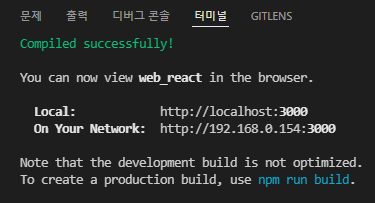
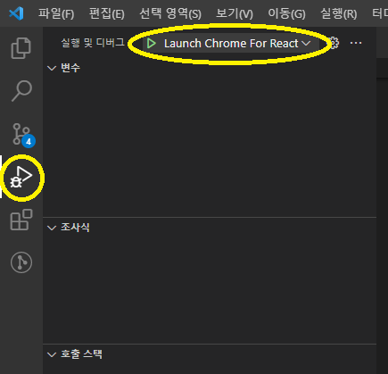

### What's included

Within the download you'll find the following directories and files:

```
javascript_project_main
    ├── packages
    │   ├── app_react
    │   │   └── package.json
    │   ├── server_express
    │   │   └── package.json
    │   └── web_react
    │       └── package.json
    ├── nodejs
    ├── node_modules(no version control)
    ├── npm-cache(no version control)
    ├── .gitignore
    ├── .npmrc
    ├── package.json
    └── README.md
```
* * *
# 프로젝트 환경 설정 가이드
### 0. 개요
> 환영합니다! 형상관리에 원활하게 접속하셨군요!   
> 위 프로젝트는 javascript로 동작하는 모듈들을 묶어 놓았습니다. app_react는 react_native 프로젝트, server_express는 express모듈을 활용한 node서버, web_react는 react입니다. 각 프로젝트의 package.json들을 참고하시면 실행에 도움이 되실거라 생각합니다. 해당 문서에서는 vscode에서의 실행에대해 설명하며, IntelliJ에서 개발을 권장 드립니다.

### 1. 사용 프로그램
> 해당 문서 및 프로젝트는 window에 접합하게 만들어 졌습니다.
> - nodejs v16.13.0 (\${프로젝트_루트}/nodejs)
> - node_modules경로 \${프로젝트_루트}/node_modules (${프로젝트_루트}/.npmrc 에 의한 경로)
> - npm-cache경로 \${프로젝트_루트}/npm-cache (${프로젝트_루트}/.npmrc 에 의한 경로)
> - node_modules는 형상관리 페이지에서 다운로드 받아서 해당 경로에 넣어 주시기 바랍니다.
> - **node offline 설정 or repository url 변경**을 안했기 때문에 해당 모듈이 없다면 오류가 발생 합니다.
> - chrome (web_react 디버깅)
### 2. .vscode 폴더
> launch.json 및 tasks.json이 작성되어 있으며 server_express와 web_react 실행에 대한 파일입니다. .gitignore에 의해 commit 제한 되어있습니다

### 3. npm install
> 터미널을 열어 ./nodejs/npm install 명령을 실행시켜줍니다. 모듈을 추가 하길 원하시면 해당 모듈의 의존성과 버전을 고려하여 /node_modules에 넣어주시면 됩니다. 쉽지 않으므로 인터넷 환경에서 다시 npm install하시는게 좋겠지만, 그것도 쉽지 않으실겁니다.

### 4. 실행
> npm install이 성공 하셨다면 debug 모드로 실행하여 개발을 진행하면 됩니다.   
> package.json 상에 존재하는 모든 npm, npx, node 명령어는 툴마다 경로가 다를 수 있습니다. vscode는 툴 자체에 node 기본 경로를 지정할 수 없어 모든 경로를 적어 주었습니다.   
>   > - web_react   
>   > 1. 디버그 실행을 위해 vscode에서 기본 제공되는 JavaScript Debugger를 사용하여 터미널에서 실행되는 npm과 vscode에서 실행시켜주는 chrome을 연결합니다.  
>   > 2. tasks.json에 정의되어 있는 runReact 를 실행 시킵니다. 메뉴 \> 터미널 \> 작업실행에서 실행시킬 수 있으며, 다른방법으로도 실행 시킬 수 있으니 찾아보시기 바랍니다.   
>   > </img><br/>
>   > </img><br/>
>   > 처음 실행이라면 해당 화면에서 오래 걸릴 수 있습니다.   
>   > </img><br/>
>   > 3. 위 화면이 정상적으로 되었다면 launch.json의 Launch Chrome For React를 실행 시켜야 합니다.   
>   > </img><br/>
>   > 위 화면으로 접근하여 시작버튼을 눌러 크롬 브라우저가 켜지면 성공입니다.
>   > 4. 중단점을 설정하여 디버깅이 잘 되는지 확인합니다. Hot Code Replace는 노드에서 수행 해주며 코드 수정 후 저장 시 터미널 콘솔에서 Compiling...이 뜨며 완료시 반영 됩니다.
>   > <br/><br/>
>   > - server_express  
>   > 1. launch.json의 Launch Server Program를 실행 시켜야 합니다. 위 설명을 참고하여 실행 시켜 보세요. Hot Code Replace 기능은 없습니다.
>   > <br/><br/>
>   > - app_react
>   > 1. 작성 바랍니다. 앱마다 더 좋은 툴을 사용하도록 하는게 좋습니다.

### 5. 알고 있어야 하는 사항
> - \${프로젝트_루트}/node_modules/.bin 에도 node가 있습니다. react 실행중 다른 모듈이 node를 불러올 수 있는데 환경변수로 node가 안되어 있다면 에러가 발생하게 됩니다. 실행 파라미터로 해결할 수 있을거 같으나 찾지 못하여 디폴트 경로에 node를 넣은 것입니다. 환경 변수로 node를 추가하면 해당 파일을 제거하셔도 무방합니다.
 